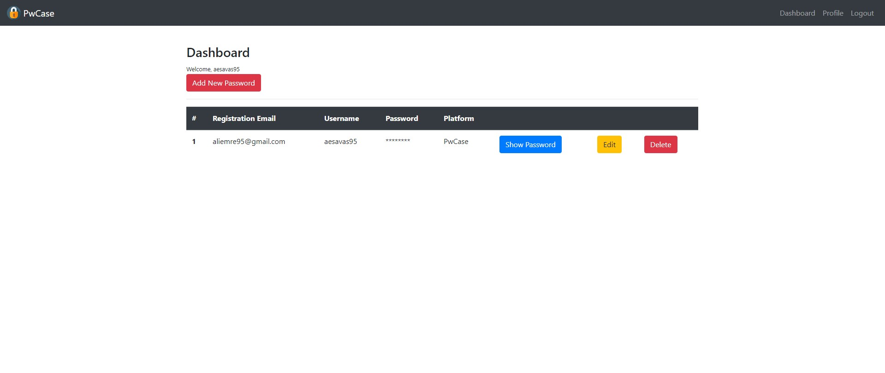
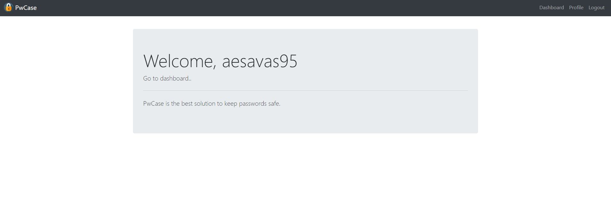
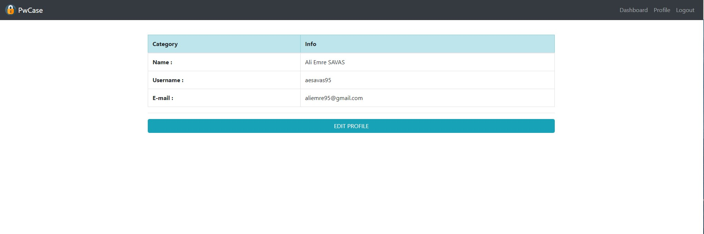
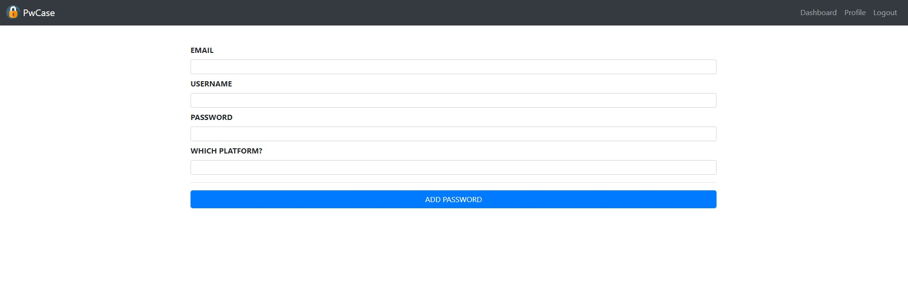
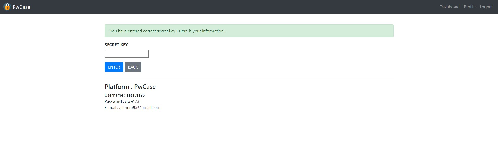
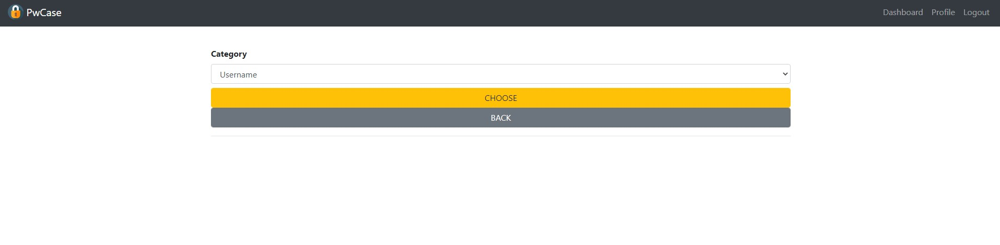

# PwCase

PwCase is a web application that store passwords of platforms. PwCase developed with Flask and Bootstrap. Passwords are stored in the database in encrypted form. 

---

## Homepage

## Profile

You can see your profile details from this page.

## Add Password

To add platform details. (Password, registration mail, username and platform name)

## Show Password

To see details you have to enter your secret key that created in the registration process. 

## Edit Profile & Edit Detail

To edit your profile or data details, you should choose a category of data.

---

## Used Technologies

* [flask] - Micro web framework
* [flask-sqlalchemy] - Flask-SQLAlchemy is an extension for Flask that adds support for SQLAlchemy to your application.
* [flask-wtf] - Simple integration of Flask and WTForms.
* [bootstrap] - For fast and responsive front-end design.
* [cryptography] - To store in the database in encrypted form.

[flask]: <http://flask.pocoo.org>
[flask-sqlalchemy]: <https://flask-sqlalchemy.palletsprojects.com/en/2.x/>
[flask-wtf]: <https://flask-wtf.readthedocs.io/en/stable/>
[bootstrap]: <https://getbootstrap.com/docs/4.5/getting-started/introduction/>
[cryptography]: <https://pypi.org/project/cryptography/>